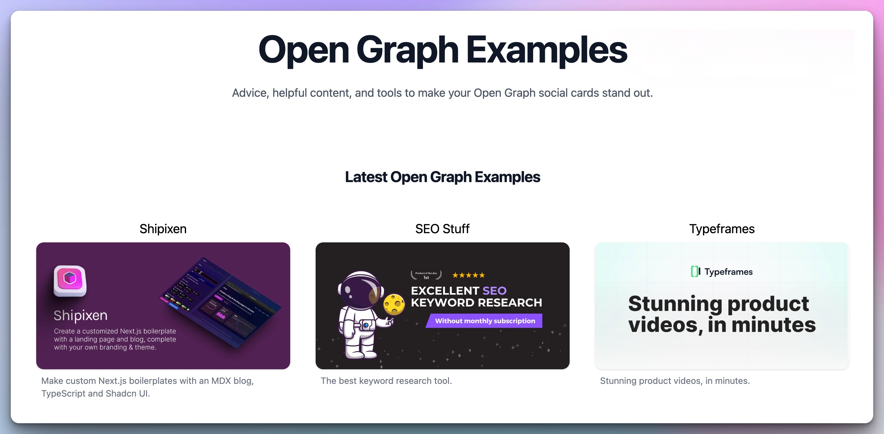

## Summary
Advice, helpful content, and tools to make your Open Graph social cards stand out.

## Key Details
- **Source:** [opengraphexamples.com](https://opengraphexamples.com/)
- **Title:** Open Graph Examples
- **Description:** Advice, helpful content, and tools to make your Open Graph social cards stand out.

## Visual Assets

