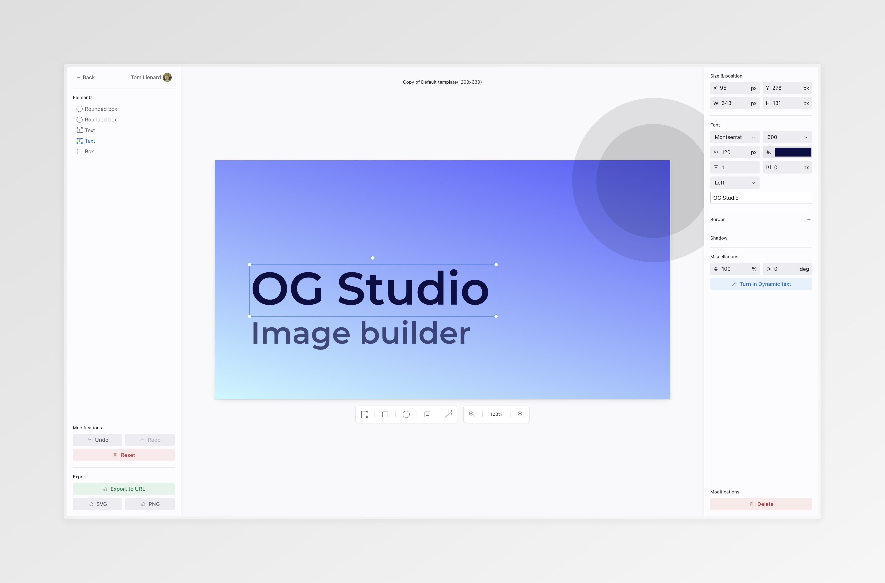

## Summary
Free, pre-made Open Graph image templates. Create static or dynamic OG (Open Graph) images with an intuitive, Figma-like visual editor.

## Key Details
- **Source:** [ogstudio.app](https://ogstudio.app/templates)
- **Title:** Open Graph image templates - OG Studio
- **Description:** Free, pre-made Open Graph image templates. Create static or dynamic OG (Open Graph) images with an intuitive, Figma-like visual editor.

## Visual Assets

