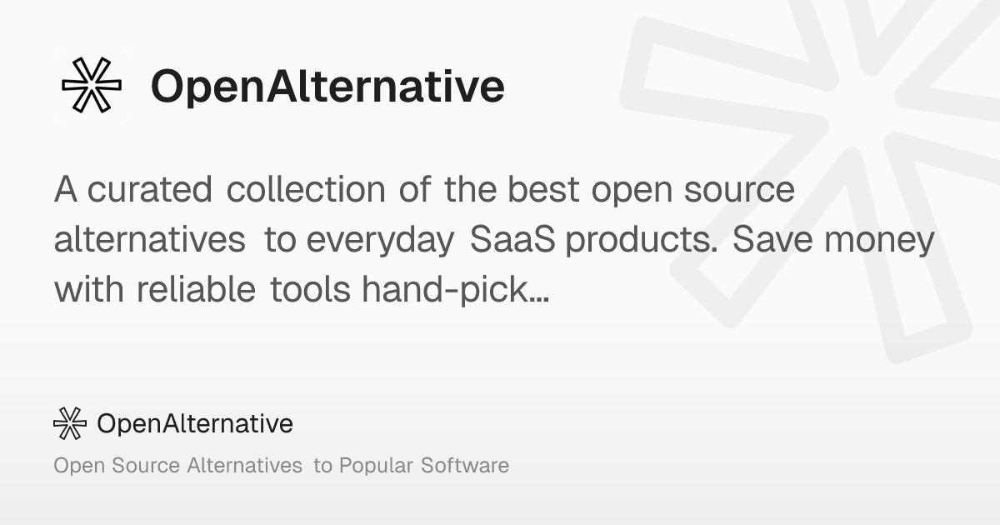

## Summary
A curated collection of the best open source alternatives to everyday SaaS products. Save money with reliable tools hand-picked for you.

## Key Details
- **Source:** [openalternative.co](https://openalternative.co/)
- **Title:** Open Source Alternatives to Popular Software
- **Description:** A curated collection of the best open source alternatives to everyday SaaS products. Save money with reliable tools hand-picked for you.

## Visual Assets

