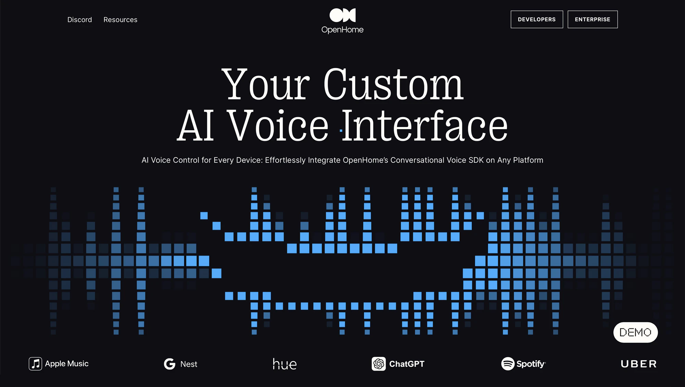

## Summary
AI Voice Control for Every Device: Effortlessly Integrate OpenHome’s Conversational Voice SDK on Any Platform

## Key Details
- **Source:** [openhome.xyz](https://openhome.xyz/?ref=designerdailyreport.com)
- **Title:** OpenHome | AI Smart Speaker & Voice SDK
- **Description:** AI Voice Control for Every Device: Effortlessly Integrate OpenHome’s Conversational Voice SDK on Any Platform

## Visual Assets

