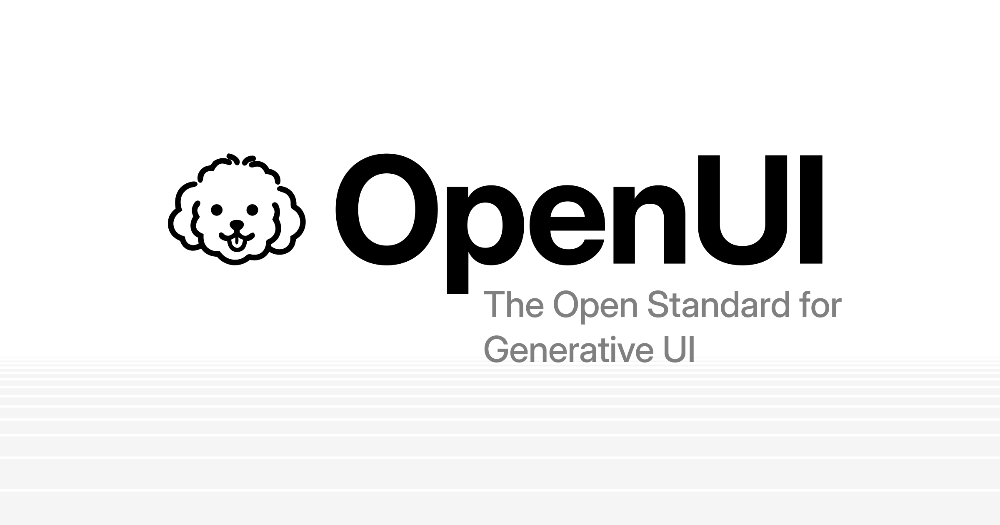

## Summary
OpenUI is a full-stack Generative UI framework with a compact streaming-first language, a React runtime with built-in components, and ready-to-use chat interfaces - using up to 67% fewer tokens than J

## Key Details
- **Source:** [openui.com](https://www.openui.com/)
- **Title:** OpenUI - The Open Standard for Generative UI
- **Description:** OpenUI is a full-stack Generative UI framework with a compact streaming-first language, a React runtime with built-in components, and ready-to-use cha

## Visual Assets

