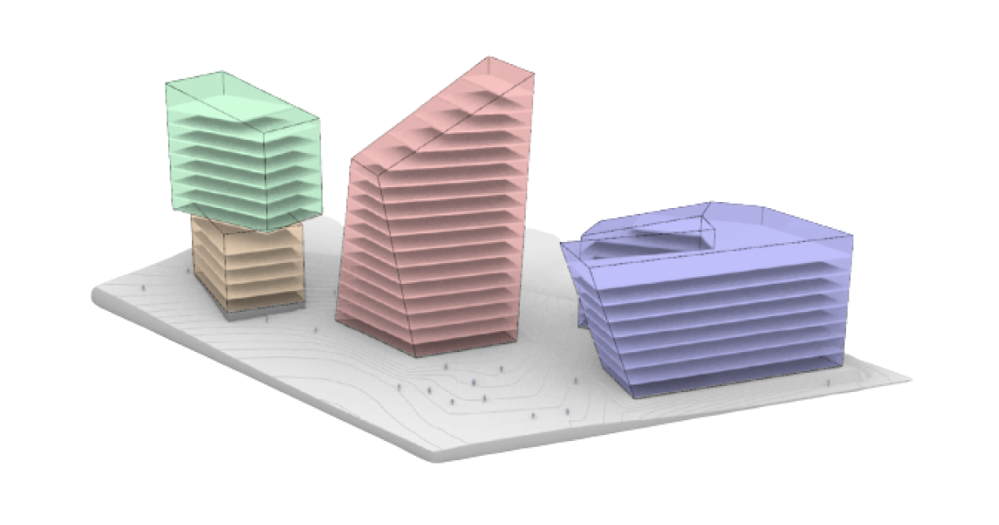

## Summary
Optimize building design with AI and graph technology. Get immediate feedback on performance, detect errors and find optimal solutions.

## Key Details
- **Source:** [finch3d.com](https://www.finch3d.com/)
- **Title:** Optimize building design with AI and graph technology. Get immediate feedback on performance, detect errors and find optimal solutions.
- **Description:** Optimize building design with AI and graph technology. Get immediate feedback on performance, detect errors and find optimal solutions.

## Visual Assets

