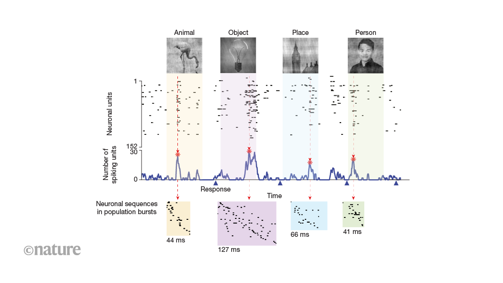

## Summary
A timing-based code for semantic knowledge in humans complements the established role of firing rates in neural coding.

## Key Details
- **Source:** [nature.com](https://www.nature.com/articles/d41586-024-03835-y)
- **Title:** Order matters: neurons in the human brain fire in sequences that encode information
- **Description:** A timing-based code for semantic knowledge in humans complements the established role of firing rates in neural coding.

## Visual Assets

