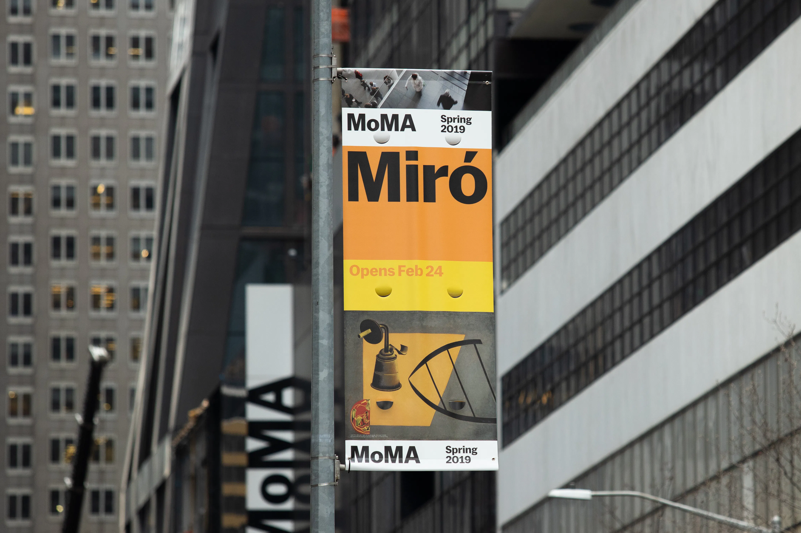

## Summary
Defining a more modular, adaptable, and scalable design system for MoMA's advertising and institutional materials.

## Key Details
- **Source:** [order.design](https://order.design/project/moma)
- **Title:** Order - MoMA
- **Description:** Defining a more modular, adaptable, and scalable design system for MoMA's advertising and institutional materials.

## Visual Assets

