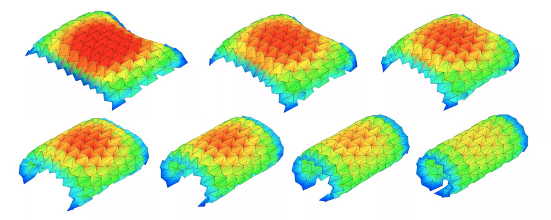

## Summary
 Real-time WebGL origami simulator app

## Key Details
- **Source:** [origamisimulator.org](https://origamisimulator.org/)
- **Title:** Origami Simulator 
- **Description:**  Real-time WebGL origami simulator app

## Visual Assets

