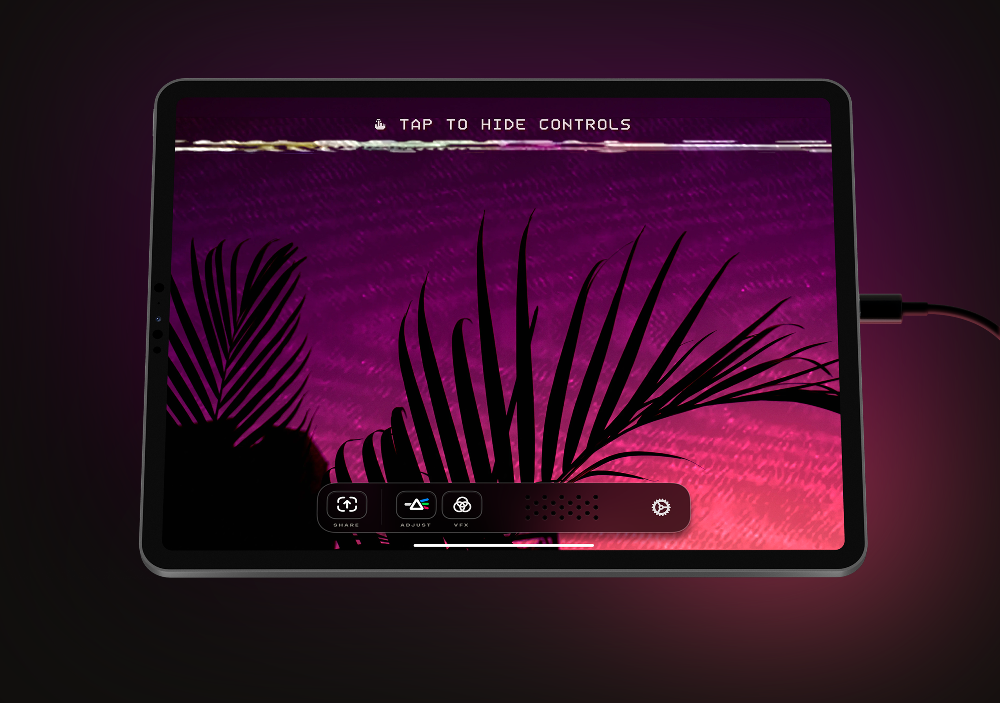

## Summary
Orion: use iPad as an external HDMI monitor.

## Key Details
- **Source:** [orion.tube](https://orion.tube/)
- **Title:** Orion — HDMI Monitor for iPad
- **Description:** Orion: use iPad as an external HDMI monitor.

## Visual Assets

