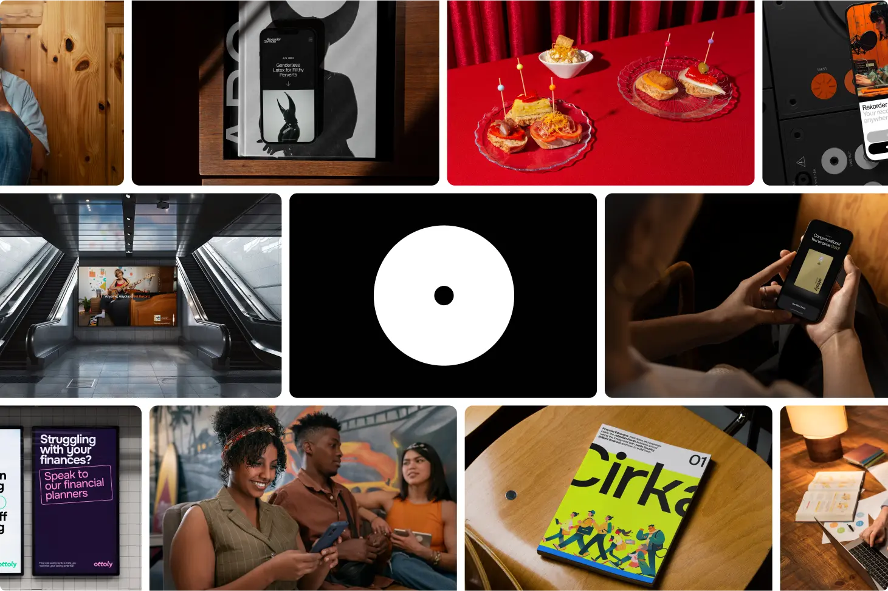

## Summary
Strategic design studio for VCs and mission-driven startups. Building brands and software that bridge technology with humanity

## Key Details
- **Source:** [otherdays.studio](https://www.otherdays.studio/)
- **Title:** Otherdays® Studio
- **Description:** Strategic design studio for VCs and mission-driven startups. Building brands and software that bridge technology with humanity

## Visual Assets

