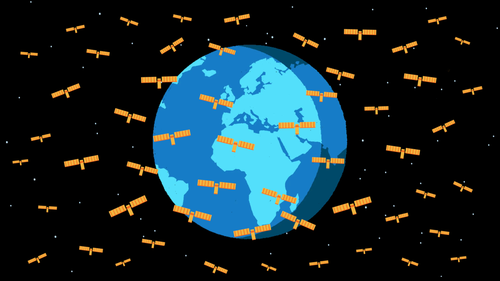

## Summary
Space-based internet is remaking Earth’s orbit — and fueling a gold rush.

## Key Details
- **Source:** [restofworld.org](https://restofworld.org/2025/satellites-space-based-internet/)
- **Title:** Out of space: Picturing the big, crowded business of satellite internet
- **Description:** Space-based internet is remaking Earth’s orbit — and fueling a gold rush.

## Visual Assets

