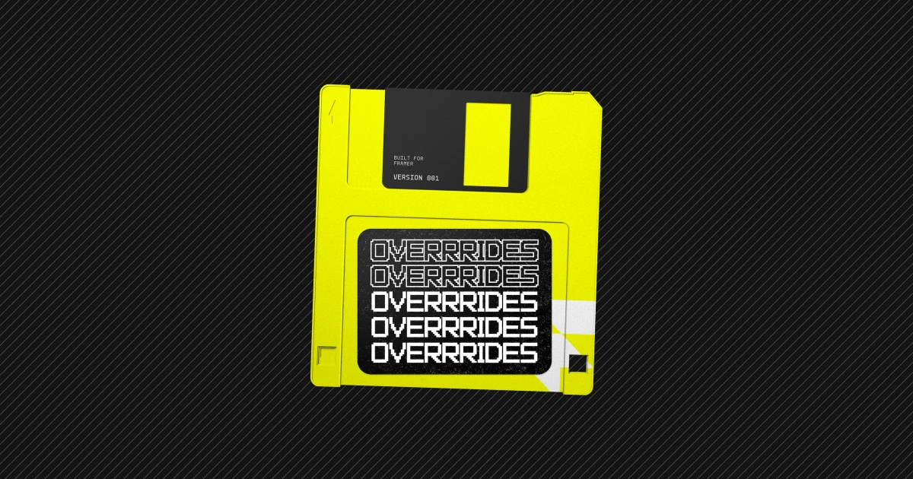

## Summary
A collection of the most powerful and customizable code overrides and components built for Framer. Copy & paste, no code required. 

## Key Details
- **Source:** [overrrides.com](https://overrrides.com/)
- **Title:** Overrrides  -  Framer Component & Override Library
- **Description:** A collection of the most powerful and customizable code overrides and components built for Framer. Copy & paste, no code required. 

## Visual Assets

