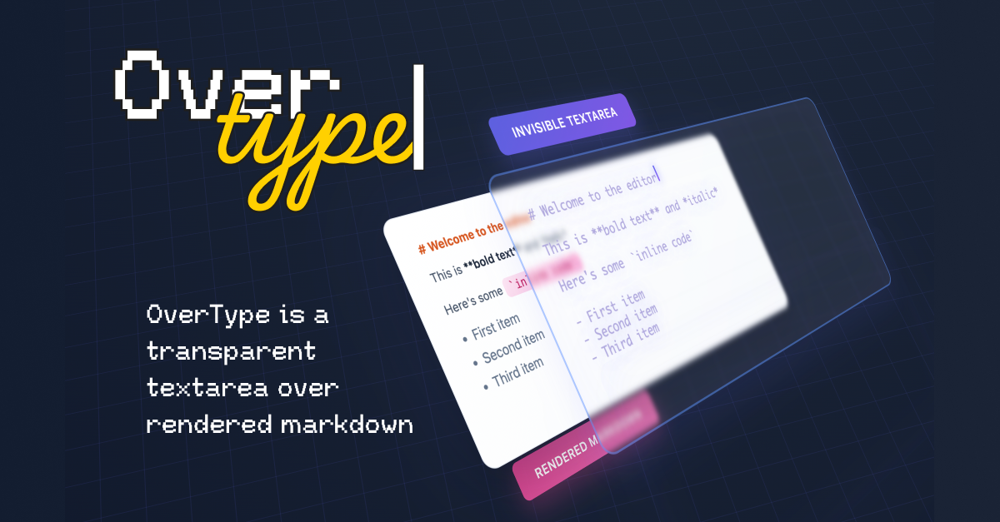

## Summary
OverType is a transparent textarea over rendered markdown. Plain text simplicity, WYSIWYG beauty, zero complexity.

## Key Details
- **Source:** [overtype.dev](https://overtype.dev/)
- **Title:** OverType - The Markdown Editor That
- **Description:** OverType is a transparent textarea over rendered markdown. Plain text simplicity, WYSIWYG beauty, zero complexity.

## Visual Assets

