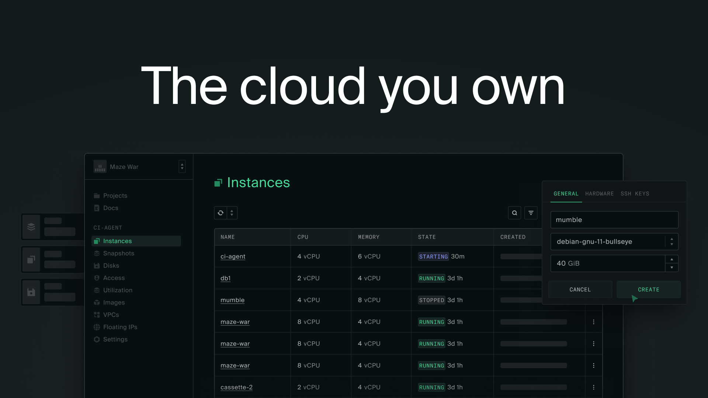

## Summary
The cloud you own. Hardware, with the software baked in, for running infrastructure at scale.

## Key Details
- **Source:** [oxide.computer](https://oxide.computer/)
- **Title:** Oxide Computer Company
- **Description:** The cloud you own. Hardware, with the software baked in, for running infrastructure at scale.

## Visual Assets

