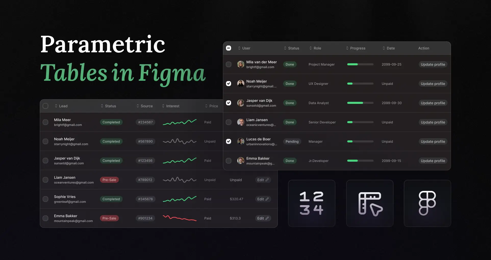

## Summary
How to create flexible and responsive tables with Figma variables | Frames X Blog: UI/UX tips, Figma tutorials and design resources.

## Key Details
- **Source:** [framesxdesign.com](https://framesxdesign.com/learn/parametric-figma-tables)
- **Title:** Parametric Tables in Figma
- **Description:** How to create flexible and responsive tables with Figma variables | Frames X Blog: UI/UX tips, Figma tutorials and design resources.

## Visual Assets

