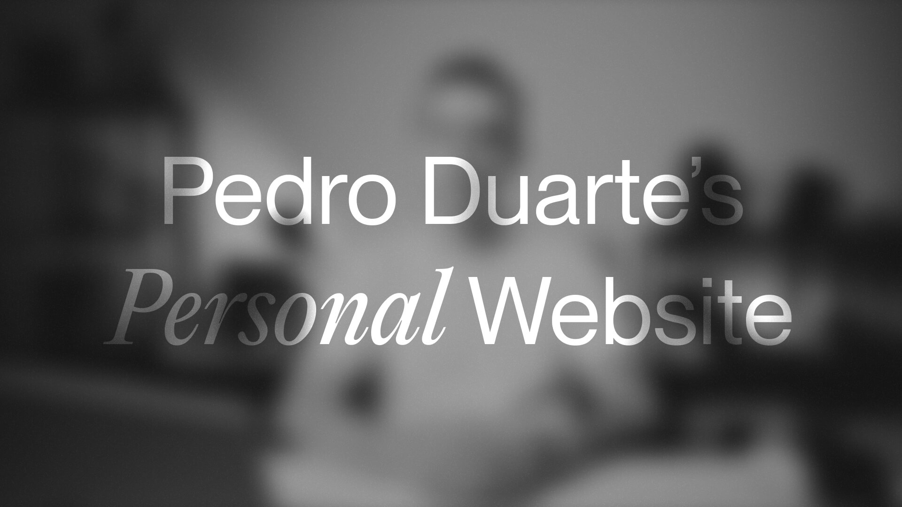

## Summary
Code, content, and other things.

## Key Details
- **Source:** [ped.ro](https://ped.ro/)
- **Title:** Pedro Duarte's Personal Website
- **Description:** Code, content, and other things.

## Visual Assets

