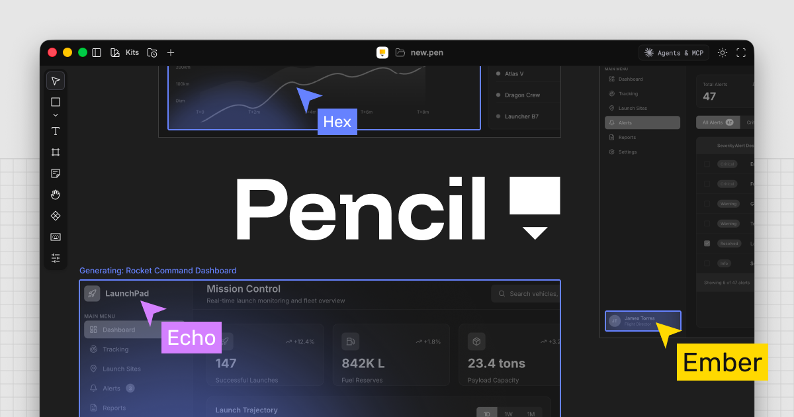

## Summary
Pencil fundamentally increases your engineering speed by bringing designing directly into your preferred IDE.

## Key Details
- **Source:** [pencil.dev](https://www.pencil.dev/)
- **Title:** Pencil – Design on canvas. Land in code.
- **Description:** Pencil fundamentally increases your engineering speed by bringing designing directly into your preferred IDE.

## Visual Assets

