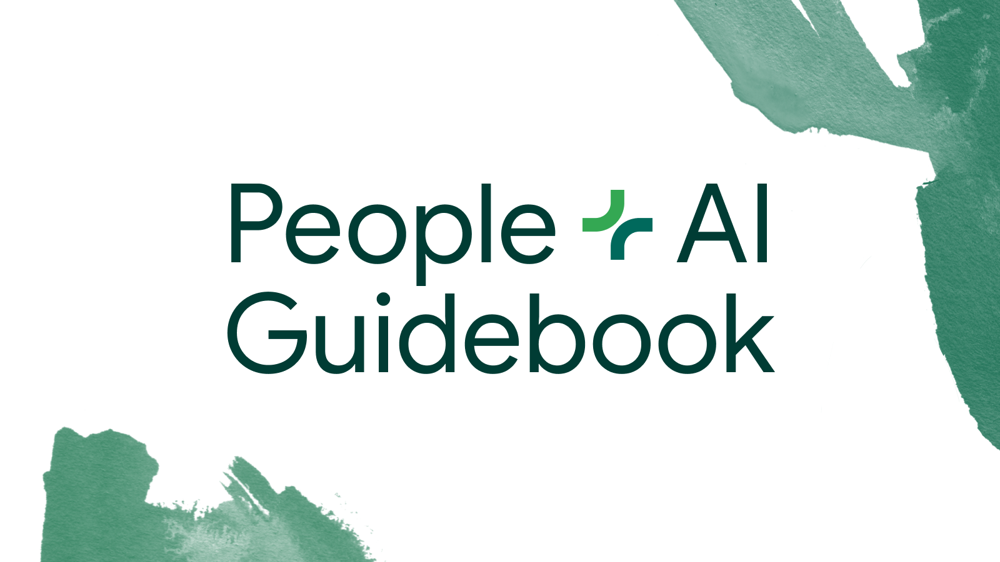

## Summary
A toolkit for teams building human-centered AI products.

## Key Details
- **Source:** [pair.withgoogle.com](https://pair.withgoogle.com/guidebook)
- **Title:** People + AI Guidebook
- **Description:** A toolkit for teams building human-centered AI products.

## Visual Assets

