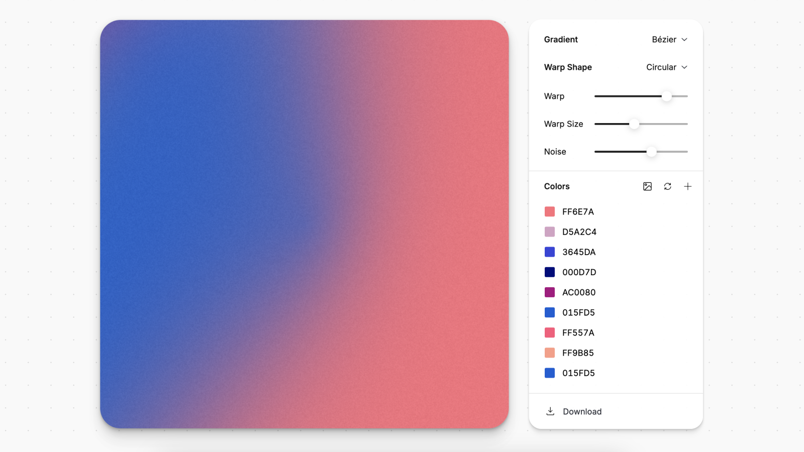

## Summary
Generate beautiful gradients from colors or from a photo

## Key Details
- **Source:** [photogradient.com](https://photogradient.com/)
- **Title:** Photo Gradient
- **Description:** Generate beautiful gradients from colors or from a photo

## Visual Assets

