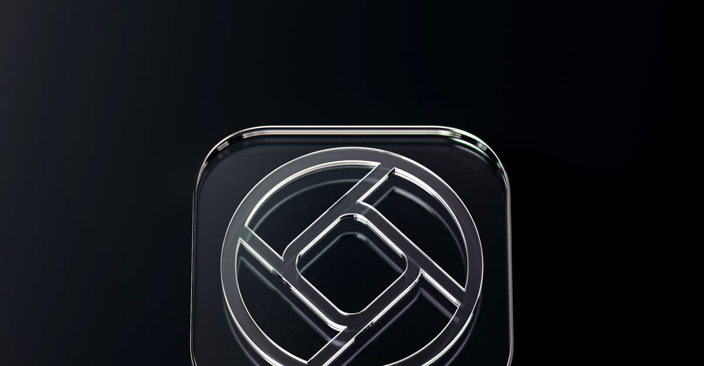

## Summary
There’s a lot of rumors of a big impending UI redesign from Apple. Let’s imagine what’s (or what could be) next for the design of iPhones, Macs and iPads.

## Key Details
- **Source:** [lux.camera](https://www.lux.camera/physicality-the-new-age-of-ui/)
- **Title:** Physicality: the new age of UI
- **Description:** There’s a lot of rumors of a big impending UI redesign from Apple. Let’s imagine what’s (or what could be) next for the design of iPhones, Macs and iP

## Visual Assets

