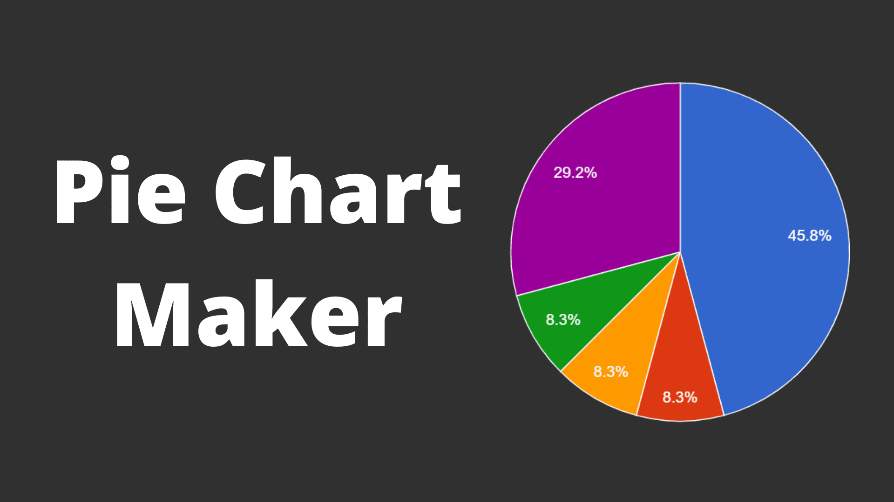

## Summary
Create a Pie Chart for free with easy to use tools and download the Pie Chart as jpg, png or svg file.

## Key Details
- **Source:** [piechartmaker.co](https://piechartmaker.co/)
- **Title:** Pie Chart Maker
- **Description:** Create a Pie Chart for free with easy to use tools and download the Pie Chart as jpg, png or svg file.

## Visual Assets

