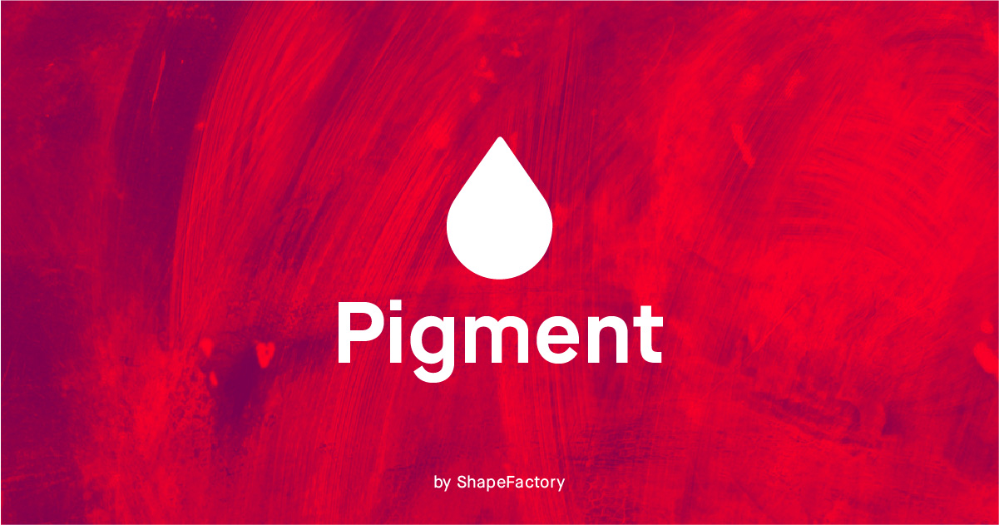

## Summary
A unique way to generate fresh and vibrant colors based on lighting and pigment, instead of math. Find a beautiful, free color palette in seconds to kick off your next project.

## Key Details
- **Source:** [pigment.shapefactory.co](https://pigment.shapefactory.co/)
- **Title:** Pigment by ShapeFactory | Simple Color Palette Generator
- **Description:** A unique way to generate fresh and vibrant colors based on lighting and pigment, instead of math. Find a beautiful, free color palette in seconds to k

## Visual Assets

