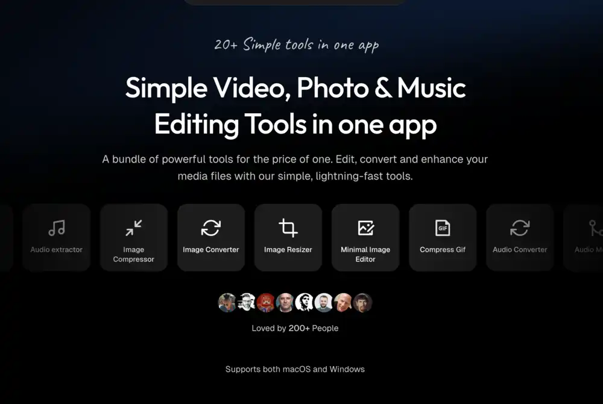

## Summary
Convert, edit, and enhance videos, images, and audio easily. Batch processing for faster work. Simple tools for everyone.

## Key Details
- **Source:** [pimosa.app](https://pimosa.app/)
- **Title:** Pimosa - Simple Video, Photo & Music Editing Tools in one app.
- **Description:** Convert, edit, and enhance videos, images, and audio easily. Batch processing for faster work. Simple tools for everyone.

## Visual Assets

