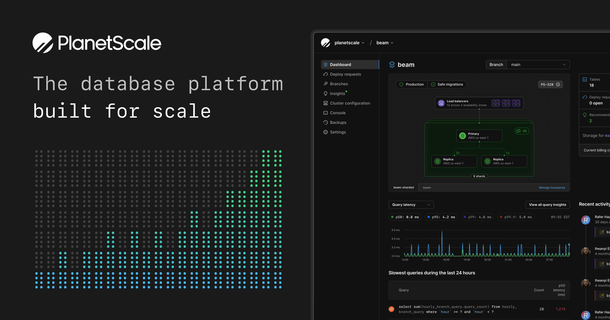

## Summary
PlanetScale offers the world’s fastest and most scalable cloud hosting for Vitess and Postgres.

## Key Details
- **Source:** [planetscale.com](https://planetscale.com/)
- **Title:** PlanetScale - the world’s fastest and most scalable cloud hosting for Vitess and Postgres
- **Description:** PlanetScale offers the world’s fastest and most scalable cloud hosting for Vitess and Postgres.

## Visual Assets

