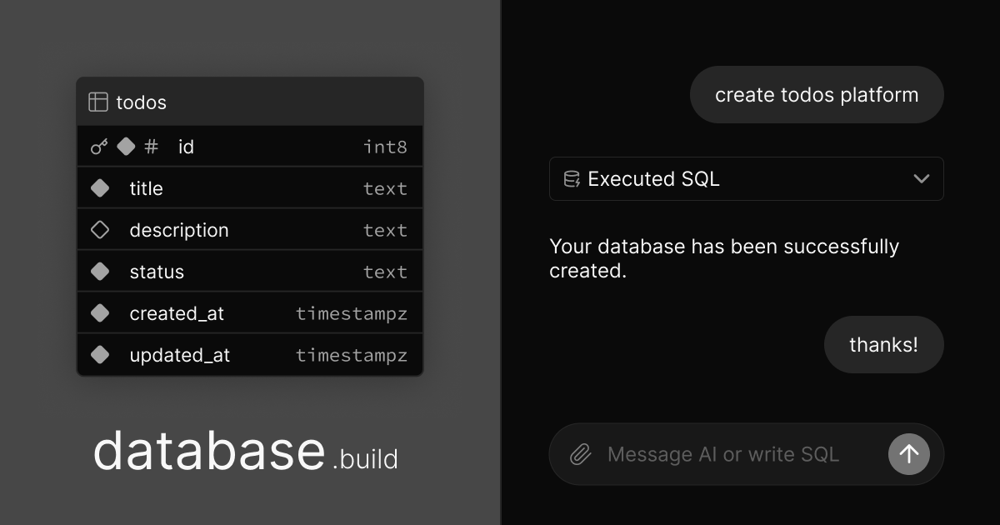

## Summary
In-browser Postgres sandbox with AI assistance

## Key Details
- **Source:** [database.build](https://database.build/)
- **Title:** Postgres Sandbox
- **Description:** In-browser Postgres sandbox with AI assistance

## Visual Assets

