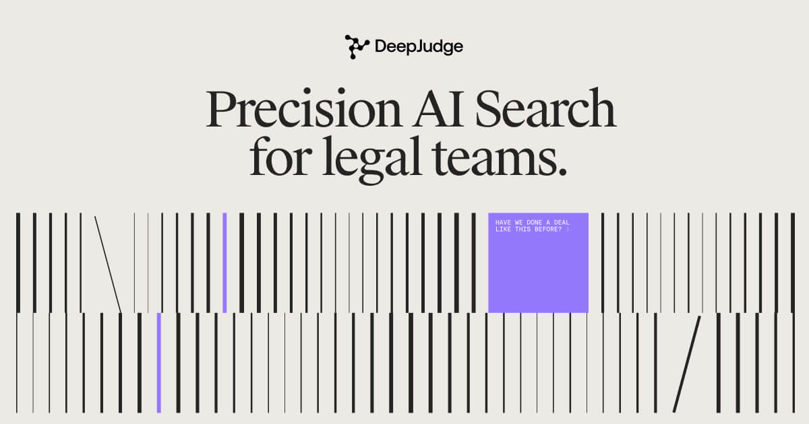

## Summary
Powered by world-class enterprise search that serves up immediate access to all of the institutional knowledge in your firm, DeepJudge enables you to build entire AI applications, encapsulate multi-st

## Key Details
- **Source:** [deepjudge.ai](https://www.deepjudge.ai/)
- **Title:** Powered by world-class enterprise search that serves up immediate access to all of the institutional knowledge in your firm, DeepJudge enables you to build entire AI applications, encapsulate multi-step workflows, and implement LLM agents.
- **Description:** Powered by world-class enterprise search that serves up immediate access to all of the institutional knowledge in your firm, DeepJudge enables you to 

## Visual Assets

