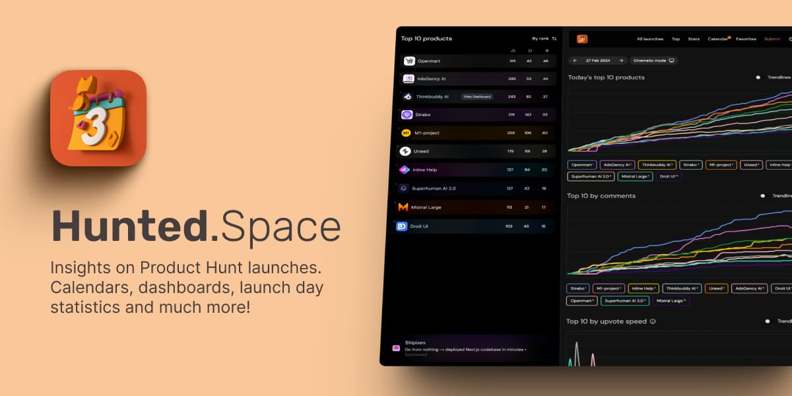

## Summary
The best new way to monitor your launch day on Product Hunt: launch calendars, upvote, comments & upvote speed statistics. Explore ranking even in the first 4 hours.

## Key Details
- **Source:** [hunted.space](https://hunted.space/)
- **Title:** Product Hunt launch day dashboard & tracking
- **Description:** The best new way to monitor your launch day on Product Hunt: launch calendars, upvote, comments & upvote speed statistics. Explore ranking even in the

## Visual Assets

