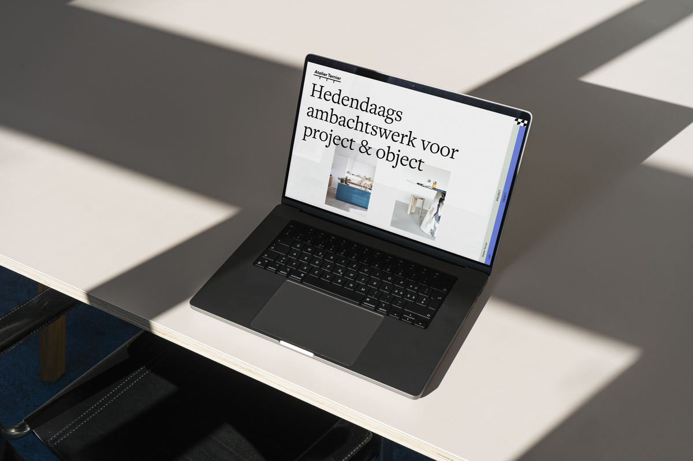

## Summary
Bar Misera brand identity, web design visit website ︎︎︎ Bar Misera is the vibrant bistro companion to...

## Key Details
- **Source:** [laurabeulens.be](https://laurabeulens.be/projects-1)
- **Title:** projects — Laura Beulens
- **Description:** Bar Misera brand identity, web design visit website ︎︎︎ Bar Misera is the vibrant bistro companion to...

## Visual Assets

