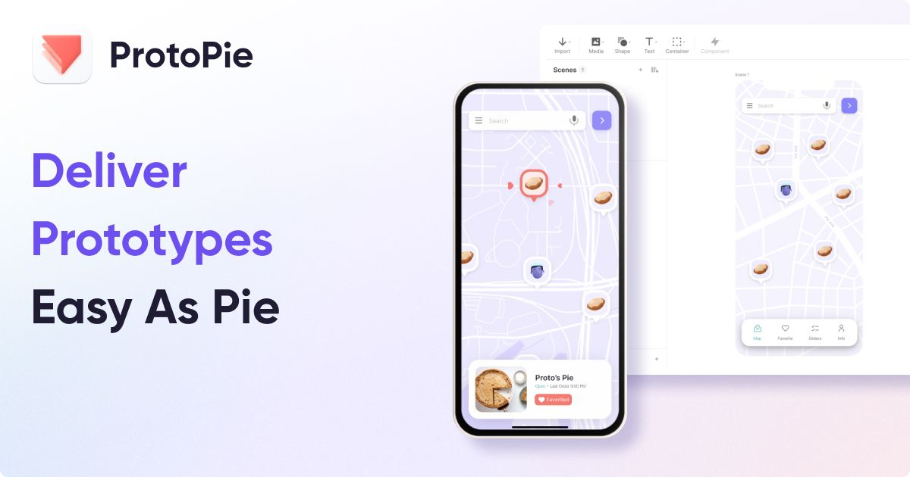

## Summary
ProtoPie: The ultimate interactive prototyping tool for designers. Create realistic, interactive prototypes easily—no coding needed!

## Key Details
- **Source:** [protopie.io](https://www.protopie.io/)
- **Title:** ProtoPie: Interactive Prototyping Tool
- **Description:** ProtoPie: The ultimate interactive prototyping tool for designers. Create realistic, interactive prototypes easily—no coding needed!

## Visual Assets

