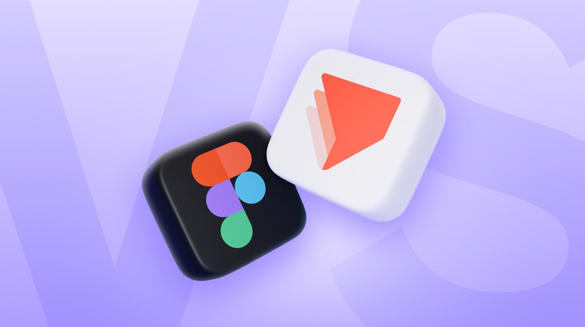

## Summary
Explore the 10 key differences between ProtoPie and Figma, and learn when to choose each tool for your advanced prototyping needs.

## Key Details
- **Source:** [protopie.io](https://www.protopie.io/blog/protopie-vs-figma)
- **Title:** ProtoPie vs. Figma: Which Tool is Better for Advanced Prototyping?
- **Description:** Explore the 10 key differences between ProtoPie and Figma, and learn when to choose each tool for your advanced prototyping needs.

## Visual Assets

