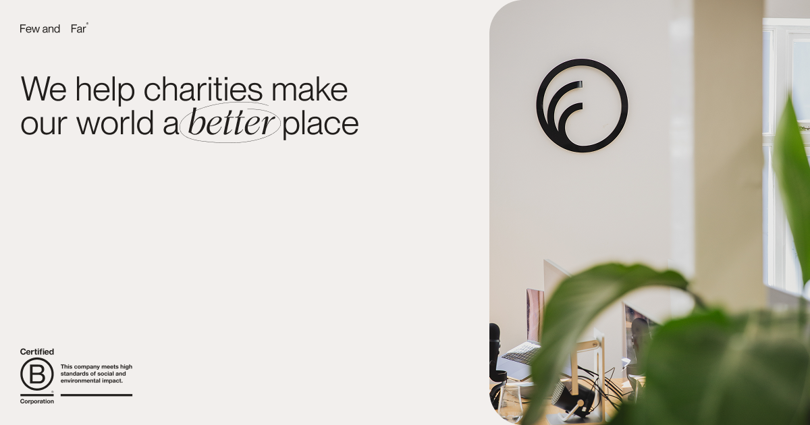

## Summary
We help charities make the world a better place, creating award-winning websites and fundraising campaigns with impact

## Key Details
- **Source:** [fewandfar.co.uk](https://www.fewandfar.co.uk/)
- **Title:** Purpose-Driven Digital Agency for Charities | Few and Far
- **Description:** We help charities make the world a better place, creating award-winning websites and fundraising campaigns with impact

## Visual Assets

