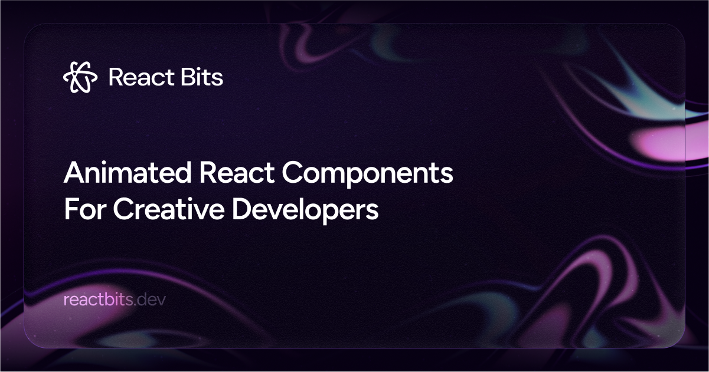

## Summary
An open source collection of high quality, animated, interactive & fully customizable React components for building stunning, memorable user interfaces.

## Key Details
- **Source:** [reactbits.dev](https://reactbits.dev/)
- **Title:** React Bits
- **Description:** An open source collection of high quality, animated, interactive & fully customizable React components for building stunning, memorable user interface

## Visual Assets

