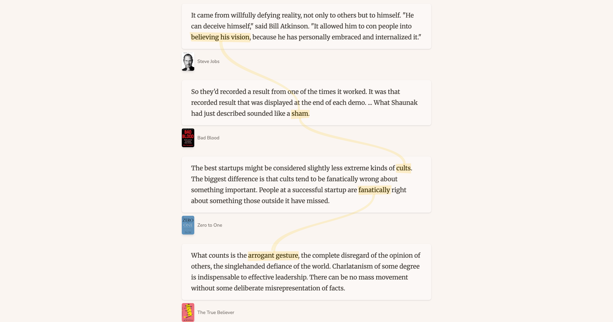

## Summary
In which we teach an agent to read syntopically.

## Key Details
- **Source:** [pieterma.es](https://pieterma.es/syntopic-reading-claude/)
- **Title:** Reading across books with Claude Code | Pieter Maes
- **Description:** In which we teach an agent to read syntopically.

## Visual Assets

