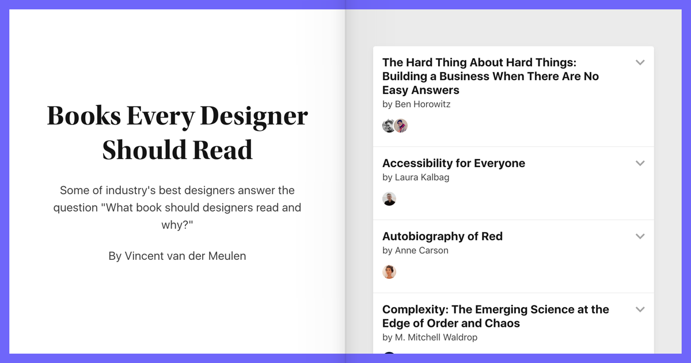

## Summary
Some of industry

## Key Details
- **Source:** [readinglist.design](https://readinglist.design/)
- **Title:** Readinglist.design - Books Every Designer Should Read
- **Description:** Some of industry

## Visual Assets

