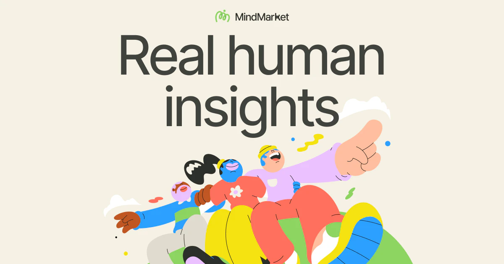

## Summary
MindMarket is a global qualitative market research agency specialising in consumer insights & qualitative market research methods.  Get in touch today!

## Key Details
- **Source:** [mindmarket.com](https://mindmarket.com/)
- **Title:** Real human insights
- **Description:** MindMarket is a global qualitative market research agency specialising in consumer insights & qualitative market research methods.  Get in touch today

## Visual Assets

