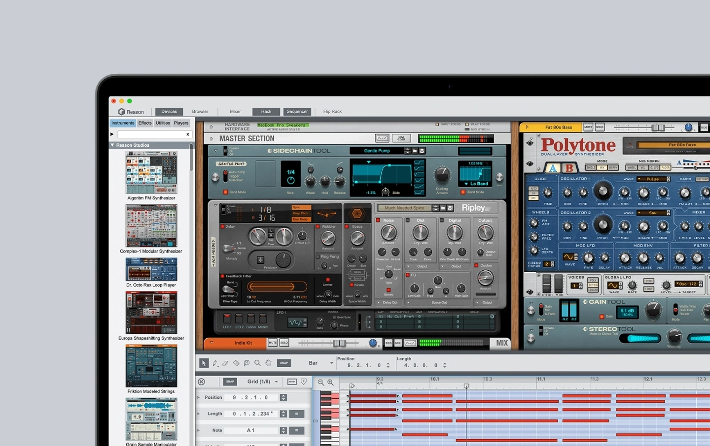

## Summary
The Rack. The Legacy. The Instruments. Your sound. Reason has everything you need to sound like you. It’s a virtual Rack where you wire up instruments and effects to create the sounds you're looking f

## Key Details
- **Source:** [reasonstudios.com](https://www.reasonstudios.com/)
- **Title:** Reason Studios
- **Description:** The Rack. The Legacy. The Instruments. Your sound. Reason has everything you need to sound like you. It’s a virtual Rack where you wire up instruments

## Visual Assets

