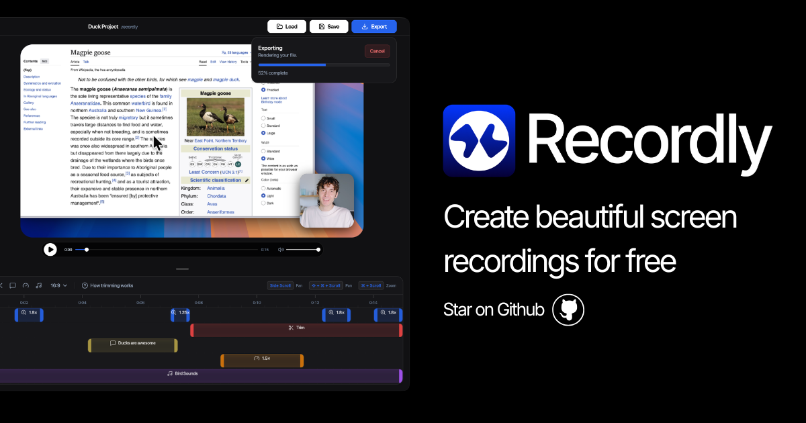

## Summary
Recordly is an open‑source screen recorder for MacOS/Windows/Linux with auto-zoom, motion blur animated cursors, and minimal interface. Used to create product demos, guided walkthroughs and more. A fr

## Key Details
- **Source:** [recordly.dev](https://recordly.dev/)
- **Title:** Recordly - Open-source app for incredible screen recordings.
- **Description:** Recordly is an open‑source screen recorder for MacOS/Windows/Linux with auto-zoom, motion blur animated cursors, and minimal interface. Used to create

## Visual Assets

