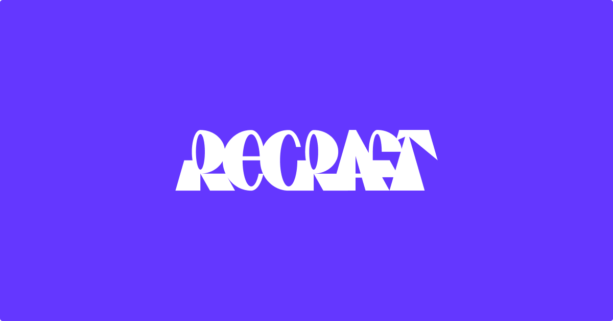

## Summary
Recraft is a top-ranked text-to-image model and design platform for photorealism, vector generation, custom styles, mockups, and more

## Key Details
- **Source:** [recraft.ai](https://www.recraft.ai/)
- **Title:** Recraft | AI for designers, creatives, sellers, and teams
- **Description:** Recraft is a top-ranked text-to-image model and design platform for photorealism, vector generation, custom styles, mockups, and more

## Visual Assets

