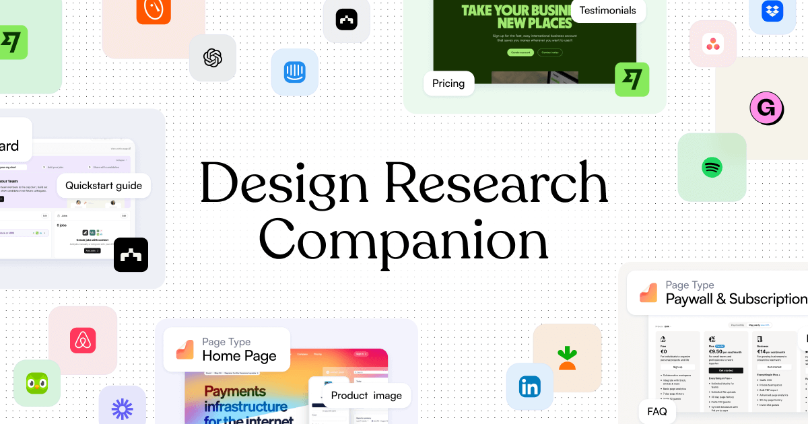

## Summary
The largest collection of UI/UX references and design inspiration for web and iOS. Explore tens of thousands of screenshots with advanced search capabilities

## Key Details
- **Source:** [refero.design](https://refero.design/)
- **Title:** Refero — UI/UX Design Inspiration for Your Next Project
- **Description:** The largest collection of UI/UX references and design inspiration for web and iOS. Explore tens of thousands of screenshots with advanced search capab

## Visual Assets

