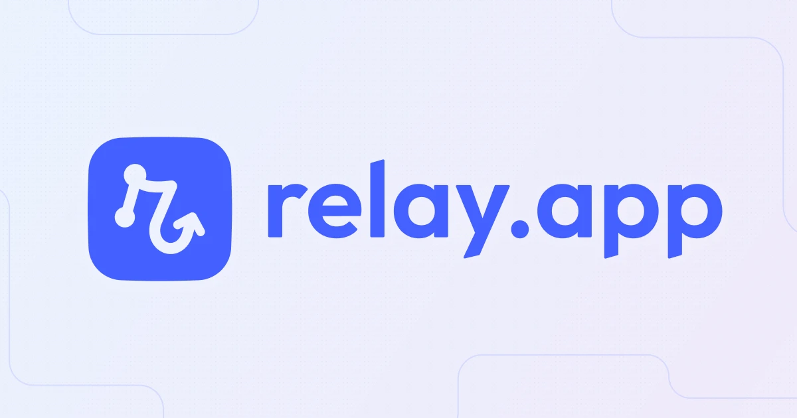

## Summary
Relay.app is the easiest way to create a team of AI agents that work for you across Gmail, Notion, HubSpot and hundreds of other apps. Relay.app agents work for you proactively day and night and get b

## Key Details
- **Source:** [relay.app](https://www.relay.app/)
- **Title:** Relay.app: Build an AI team that works for you
- **Description:** Relay.app is the easiest way to create a team of AI agents that work for you across Gmail, Notion, HubSpot and hundreds of other apps. Relay.app agent

## Visual Assets

