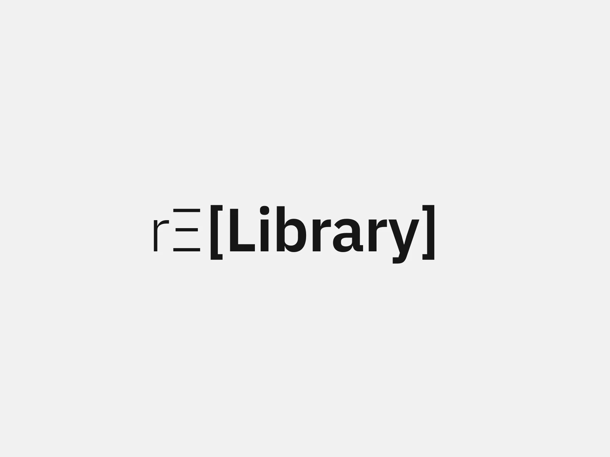

## Summary
This is a component library designed for individuals looking to effortlessly craft websites using Framer.

## Key Details
- **Source:** [relibrary.framer.website](https://relibrary.framer.website/)
- **Title:** Relibrary
- **Description:** This is a component library designed for individuals looking to effortlessly craft websites using Framer.

## Visual Assets

