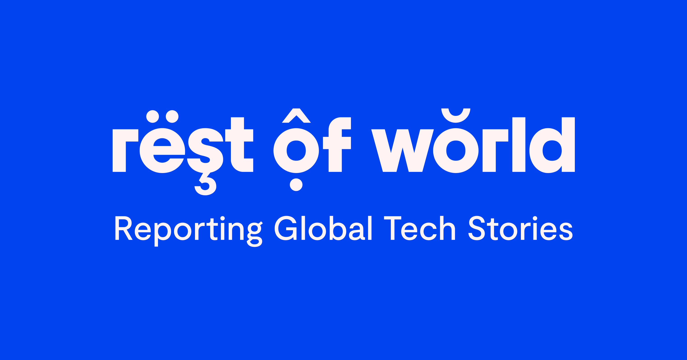

## Summary
We’re a global nonprofit publication covering the impact of technology beyond the Western bubble.

## Key Details
- **Source:** [restofworld.org](https://restofworld.org/)
- **Title:** Rest of World
- **Description:** We’re a global nonprofit publication covering the impact of technology beyond the Western bubble.

## Visual Assets

