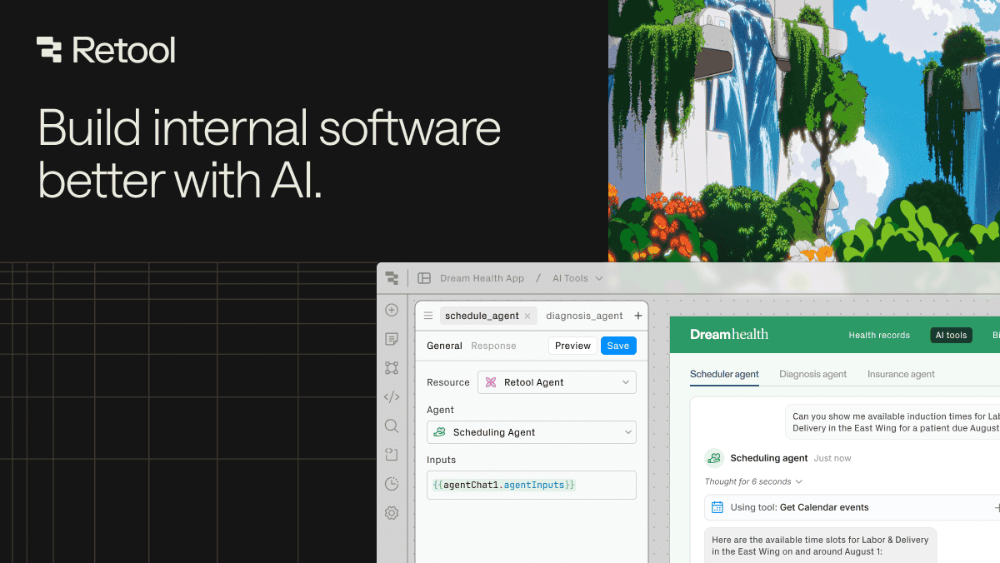

## Summary
Build, deploy, and manage internal tools with Retool’s unified engine. Connect to any database, API, or LLM. Leverage AI throughout your business.

## Key Details
- **Source:** [retool.com](https://retool.com/)
- **Title:** Retool | Build internal software better, with AI.
- **Description:** Build, deploy, and manage internal tools with Retool’s unified engine. Connect to any database, API, or LLM. Leverage AI throughout your business.

## Visual Assets

