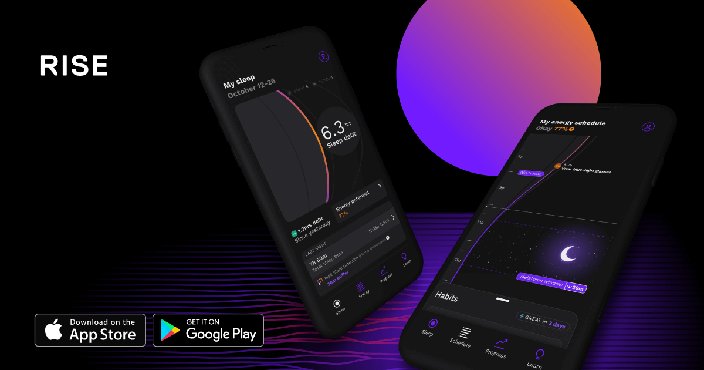

## Summary
RISE shows you how to get better sleep and when your personal energy peaks and dips will be, to help you reach your potential.

## Key Details
- **Source:** [risescience.com](https://www.risescience.com/)
- **Title:** RISE shows you how to get better sleep and when your personal energy peaks and dips will be, to help you reach your potential.
- **Description:** RISE shows you how to get better sleep and when your personal energy peaks and dips will be, to help you reach your potential.

## Visual Assets

