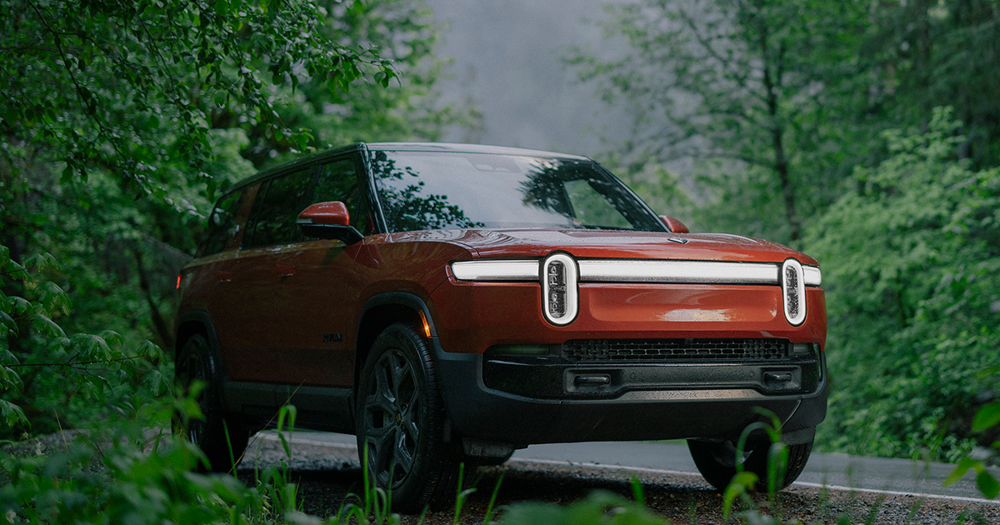

## Summary
Discover Rivian's long-range electric vehicles, innovative EV trucks, SUVs and vans built for adventure. Join the movement towards a sustainable future.

## Key Details
- **Source:** [rivian.com](https://rivian.com/)
- **Title:** Rivian: Electric Vehicles Designed For Adventure
- **Description:** Discover Rivian's long-range electric vehicles, innovative EV trucks, SUVs and vans built for adventure. Join the movement towards a sustainable futur

## Visual Assets

