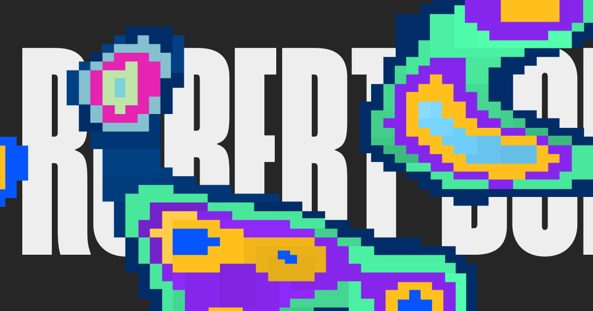

## Summary
Just an Okay Creative Dev

## Key Details
- **Source:** [robertborghesi.is](https://robertborghesi.is/)
- **Title:** Robert Borghesi — Creative Dev
- **Description:** Just an Okay Creative Dev

## Visual Assets

