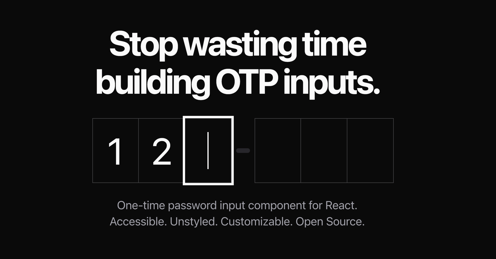

## Summary
One-time password input component for React. Accessible. Unstyled. Customizable. Open Source. Build your own OTP form effortlessly.

## Key Details
- **Source:** [input-otp.rodz.dev](https://input-otp.rodz.dev/)
- **Title:** rodz/input-otp
- **Description:** One-time password input component for React. Accessible. Unstyled. Customizable. Open Source. Build your own OTP form effortlessly.

## Visual Assets

