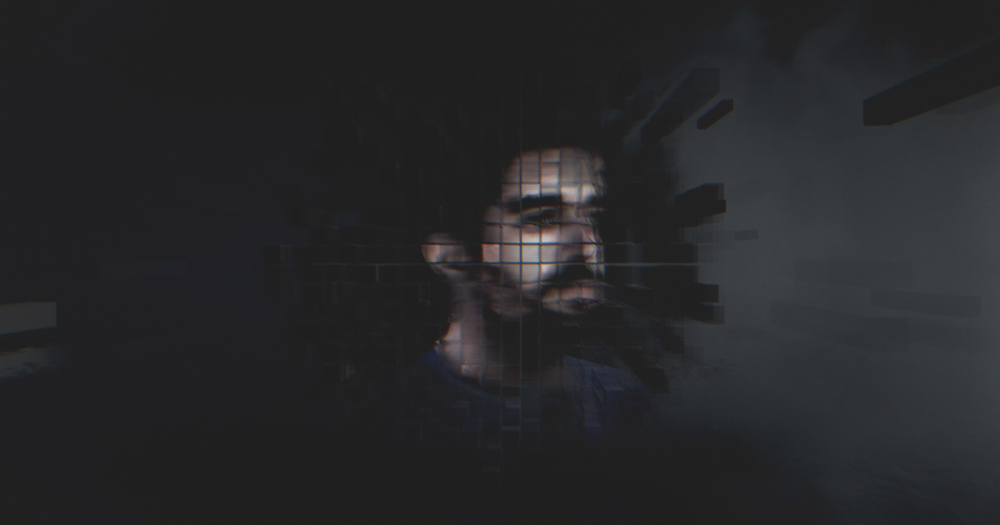

## Summary
Portfolio of Rogier de Boevé, Belgium-based creative developer

## Key Details
- **Source:** [rogierdeboeve.com](https://rogierdeboeve.com/)
- **Title:** Rogier de Boevé - Creative Developer
- **Description:** Portfolio of Rogier de Boevé, Belgium-based creative developer

## Visual Assets

