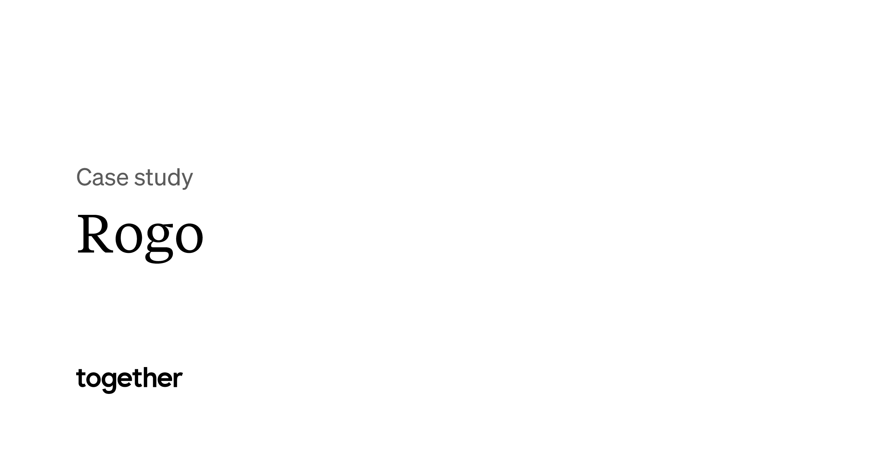

## Summary
Saved from together.agency: Rogo by Together. A case study

## Key Details
- **Source:** [together.agency](https://together.agency/work/rogo/)
- **Title:** Rogo by Together. A case study

## Visual Assets

